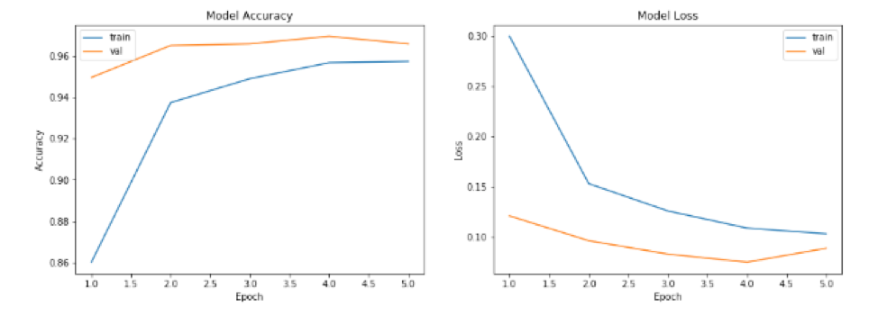
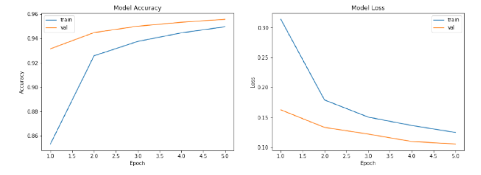
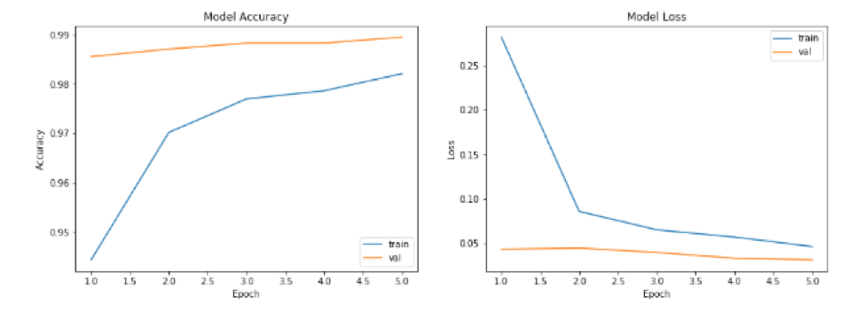
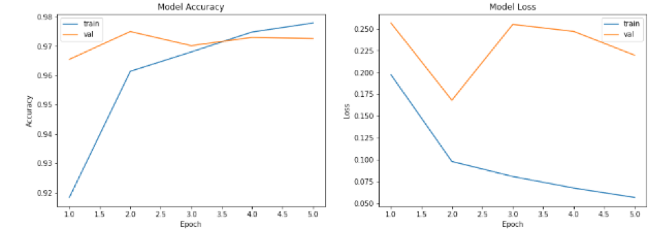
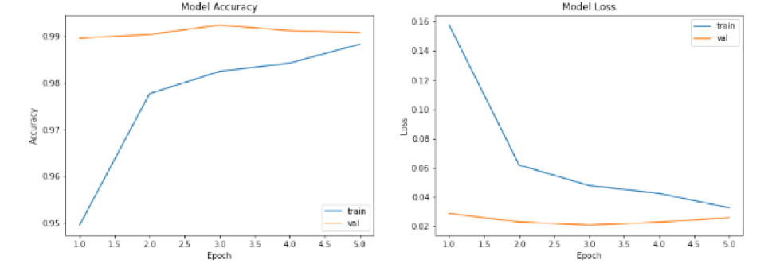

# Kaggle competition for dogs-vs-cats

## Introduction
### Project Overview

Cats and dogs are the most favorite pets in our daily life. Therefore, we always have photos containing cats or dogs in our albums. Sometimes we try to classify these photos into categories. What if we do these things automatically rather than by our own hands or eyes? With the technology of computer vision, the knowledge of machine learning or more precisely deep learning, these problems can be solved.

In this project, I try different model to build a satisfy model for this dataset. I show and use some optimize ways which learned in our class. Although I tried a lot of models and made multiple adjustments to the model. However, there is still room for improvement, and I hope that I can learn more optimization methods later and improve the project.

### Project Statement

This is a supervised learning problem because each example in training data is a pair consisting of an input image and a desired output value (cat or dog). The classifier implements a binary classification considering the goal is to tell you if it is cats or dogs in the image when you put an image into the classifier.

### Metrics
 
•	n: the number of images in the test set  
•	𝑦̂: the predicted probability of the image being a dog 𝑖  
•	𝑦 𝑖 : 1 if the image is a dog, 0 if cat  

## Analysis
### Data Exploration

The dataset downloaded from Kaggle contains two files, test and train. The train folder contains 12500 images of dogs and 12500 images of cats. Each image in this folder has the label as part of the filename. The test folder contains 12,500 images, named according to a numeric id without label. Images from test or train folders are ordinary daily images including cats or dogs with shapes and sizes.

### Algorithms and Techniques

In this project I mainly use convolutional neural networks to build my algorithm model. Convolutional neural networks are multi-layer neural networks that excel at dealing with related machine learning problems of images, especially large images. Convolutional networks have successfully reduced the image recognition problem with large data volume through convolution, pooling, and full connection, and finally enabled them to be trained. In this project, I will apply the methods I have learned in the course of convolution, pooling, RELU activation function, dropout layer, etc. I briefly introduce the layers which I use in our model below.

1.	Convolution layer
Through the convolution operation, the computationally intensive image recognition problem is continuously reduced, and finally it can be trained by the neural network. Intuitively, the convolutional layer can be thought of as a series of training/learning filters. A convolution filter slides over each pixel to form a new 3-dimensional output data. Each filter only cares about some of the features in the filtered data facet, and when it appears, it will be active.

2.	Pooling layer
The data after the convolution process can theoretically be used for training, but the amount of calculation is still too large. In order to reduce the amount of calculation and improve the generalization ability of the model, we will pool it. There are usually three ways to pool:
A.	Mean-pooling, that is, averaging only the feature points in the neighborhood, and retaining the background better.
B.	max-pooling, which is the largest for feature points in the neighborhood and better for texture extraction.
C.	Stochastic-pooling, between the two, by giving the pixel a probability by numerical value.

3.	RELU
In deep neural networks, a called Rectified Linear Unit (RELU) is often used as the activation function of neurons. Compared to other activation functions, RELU has the following advantages: For linear functions, RELU is more expressive, especially in deep networks; for nonlinear functions, RELU is due to non-negative interval gradients. Constant, so there is no gradient disappearance problem, so that the convergence speed of the model is maintained at a stable state.

4.	Dropout
Dropout refers to the temporary discarding of neural network units from the network with a certain probability during the training of the deep learning network. This approach reduces the interaction between feature detectors and enhances the generalization capabilities of the model.

## Implementation
### Data preprocessing

A.	The picture name in the training set is named after "cat/dog + num.jpg", each with 12,500 sheets. So first you need to classify the training set by name based on the keyword cat and dog.
B.	Perform preprocessing operations on the picture size of the training set and the verification set.
C.	Since the size of the image required by each model is (224, 224, 3), the model needs to be designed according to the input.

### Methods

I use different base models including VGG16, VGG19, ResNet50, InceptionResNetV2 and DenseNet121. I add GlobalMaxPooling2D, Dense which activation is RELU, 0.5 Dropout layer and Dense layer in the final.

I also meet some problems, I show my methods how to solve them.

- A.	Slow training speed	
In the previous machine learning project, the amount of data and the amount of calculation were not large. I use my own laptop to train the model using the CPU. But this time, when I ran the deep learning model, I found that I couldn’t move at all. It took more than 6 hours to train a round. To solve this problem, change the GPU to train your own model and use the Amazon AWS GPU to train the model. After the improvement, the training time of each model is shortened to 30 minutes.

- B.	Resource Exhausted Error
When using the GPU for training, I encountered a Resource Exhausted Error. Due to the large batch_size setting at the beginning, it takes up a lot of memory resources and cannot train too much data at once. Finally, the smaller batch_size is used for training.

- C.	Optimizer selection
Generally, we all choose the Adam method. In this project, I found that the Adam algorithm is not suitable for me. There are two reasons. First, the Adam algorithm will take up more GPU resources, and my own GPU resources are already very scarce. Second, I found that the convergence speed of the Adam algorithm in this project is not as fast as I thought. When the accuracy reaches 90%, the convergence is very slow. Finally, the learning rate is set to 0.0001 and the momentum is set to 0.9 for better results.
o
pt = SGD(lr = 0.0001, momentum = 0.9)

- D.	Set the Dropout
Based on the basic model, I added Flatten, a fully connected layer, and Dropout to build my final model. Add Dropout to prevent model overfitting and set the Dropout rate to 0.5. 

## Results

In Table 1, we can get the training time and accuracy in different model results. The final model of all models trained has an accuracy of over 99%.

| Model | Training Time（second | Accuracy |
| :----:| :----: | :----: |
| VGG16	| 2250 | 0.9658 |
| VGG19	| 2300 | 0.9557 |
| ResNet50 | 3390 | 0.9895 |
| nceptionResNetV2	|	6540 | 0.9726 |
| DenseNet121 | 3450 | 0.9907 |

Table 1: Comparing training time and accuracy in different model results

## Conclusion

As can be seen from the figure below, the training and test accuracy rates of each model increase with the increase of the number of training. At the same time training and verification loss continues to decline.

**VGG16**

**VGG19**

**ResNet50**

**InceptionResNetV2**

**DenseNet121**

## Thinking and improvement
### Thinking

Through this project, I have increased my understanding of neural networks, mainly including the following two points:

- A.	The importance of pretreatment
Data preprocessing is very important for any model. Good pre-processing can greatly save computer memory, reduce training time and improve model accuracy.
- B.	optimizer parameter
Different optimizer choices have different effects on the model. There is no one-size-fits-all approach to all projects, and only specific issues can be analyzed.

### Improvement

There are limited ways to improve accuracy through various methods using a single model approach. If the model fusion method is adopted, the advantages of multiple models can be collected to further improve the accuracy.
